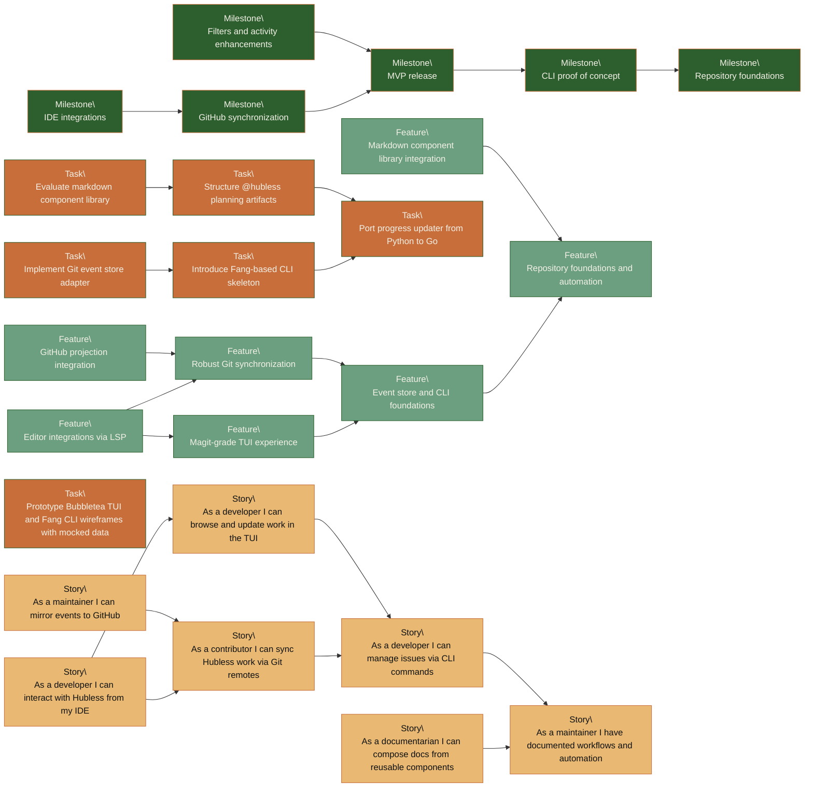

# Hubless Roadmap Data

Structured roadmap data lives alongside JSON schemas so automation can generate schedules, dependency graphs, and dashboards.

> Regenerate this document with `make docs` after updating roadmap JSON.

## Snapshot

<!-- Generated by docs-components; do not edit manually. -->
| Artifact | Progress | Done | Total |
| --- | --- | --- | --- |
| Milestones | [----------] 0% | 0 | 6 |
| Features | [----------] 0% | 0 | 7 |
| Stories | [----------] 0% | 0 | 7 |
| Tasks | [##--------] 17% | 1 | 6 |

## Dependencies

<!-- Generated by docs-components; do not edit manually. -->
### Milestones

| ID | Depends On |
|----|-------------|
| [hubless/milestone/m0-5-cli-proof](../milestones/hubless-milestone-m0-5-cli-proof.json) | hubless/milestone/m0-foundations |
| [hubless/milestone/m1-5-enhancements](../milestones/hubless-milestone-m1-5-enhancements.json) | hubless/milestone/m1-mvp |
| [hubless/milestone/m1-mvp](../milestones/hubless-milestone-m1-mvp.json) | hubless/milestone/m0-5-cli-proof |
| [hubless/milestone/m2-github-sync](../milestones/hubless-milestone-m2-github-sync.json) | hubless/milestone/m1-mvp |
| [hubless/milestone/m3-ide](../milestones/hubless-milestone-m3-ide.json) | hubless/milestone/m2-github-sync |

### Features

| ID | Depends On |
|----|-------------|
| [hubless/feature/docs-components](../features/hubless-feature-docs-components.json) | hubless/feature/repo-foundations |
| [hubless/feature/event-store-cli](../features/hubless-feature-event-store-cli.json) | hubless/feature/repo-foundations |
| [hubless/feature/git-sync](../features/hubless-feature-git-sync.json) | hubless/feature/event-store-cli |
| [hubless/feature/github-projection](../features/hubless-feature-github-projection.json) | hubless/feature/git-sync |
| [hubless/feature/ide-integration](../features/hubless-feature-ide-integration.json) | hubless/feature/tui-experience, hubless/feature/git-sync |
| [hubless/feature/tui-experience](../features/hubless-feature-tui-experience.json) | hubless/feature/event-store-cli |

### Stories

| ID | Depends On |
|----|-------------|
| [hubless/story/0002](../../issues/stories/hubless-story-0002.json) | hubless/story/0001 |
| [hubless/story/0003](../../issues/stories/hubless-story-0003.json) | hubless/story/0002 |
| [hubless/story/0004](../../issues/stories/hubless-story-0004.json) | hubless/story/0002 |
| [hubless/story/0005](../../issues/stories/hubless-story-0005.json) | hubless/story/0004 |
| [hubless/story/0006](../../issues/stories/hubless-story-0006.json) | hubless/story/0004, hubless/story/0003 |
| [hubless/story/0007](../../issues/stories/hubless-story-0007.json) | hubless/story/0001 |

### Tasks

| ID | Depends On |
|----|-------------|
| [hubless/m0/task/0004](../../issues/tasks/hubless-m0-task-0004.json) | hubless/m0/task/0001 |
| [hubless/m0/task/0005](../../issues/tasks/hubless-m0-task-0005.json) | hubless/m0/task/0004 |
| [hubless/m1/task/0002](../../issues/tasks/hubless-m1-task-0002.json) | hubless/m0/task/0001 |
| [hubless/m1/task/0003](../../issues/tasks/hubless-m1-task-0003.json) | hubless/m1/task/0002 |

## Dependency Graph

<!-- Generated by docs-components; do not edit manually. -->

## Milestones

JSON records under `milestones/` follow `@hubless/schema/milestone.schema.json`.

<!-- Generated by docs-components; do not edit manually. -->
| ID | Title | Status |
|----|-------|--------|
| [hubless/milestone/m0-5-cli-proof](../milestones/hubless-milestone-m0-5-cli-proof.json) | CLI proof of concept | PLANNED |
| [hubless/milestone/m0-foundations](../milestones/hubless-milestone-m0-foundations.json) | Repository foundations | IN_PROGRESS |
| [hubless/milestone/m1-5-enhancements](../milestones/hubless-milestone-m1-5-enhancements.json) | Filters and activity enhancements | PLANNED |
| [hubless/milestone/m1-mvp](../milestones/hubless-milestone-m1-mvp.json) | MVP release | PLANNED |
| [hubless/milestone/m2-github-sync](../milestones/hubless-milestone-m2-github-sync.json) | GitHub synchronization | PLANNED |
| [hubless/milestone/m3-ide](../milestones/hubless-milestone-m3-ide.json) | IDE integrations | PLANNED |

## Features

Feature records under `features/` follow `@hubless/schema/feature.schema.json`.

<!-- Generated by docs-components; do not edit manually. -->
| ID | Title | Status |
|----|-------|--------|
| [hubless/feature/docs-components](../features/hubless-feature-docs-components.json) | Markdown component library integration | PLANNED |
| [hubless/feature/event-store-cli](../features/hubless-feature-event-store-cli.json) | Event store and CLI foundations | PLANNED |
| [hubless/feature/git-sync](../features/hubless-feature-git-sync.json) | Robust Git synchronization | PLANNED |
| [hubless/feature/github-projection](../features/hubless-feature-github-projection.json) | GitHub projection integration | PLANNED |
| [hubless/feature/ide-integration](../features/hubless-feature-ide-integration.json) | Editor integrations via LSP | PLANNED |
| [hubless/feature/repo-foundations](../features/hubless-feature-repo-foundations.json) | Repository foundations and automation | IN_PROGRESS |
| [hubless/feature/tui-experience](../features/hubless-feature-tui-experience.json) | Magit-grade TUI experience | PLANNED |

## Stories

Stories reside in `../issues/stories/` following `@hubless/schema/story.schema.json`.

<!-- Generated by docs-components; do not edit manually. -->
| ID | Title | Status |
|----|-------|--------|
| [hubless/story/0001](../../issues/stories/hubless-story-0001.json) | As a maintainer I have documented workflows and automation | IN_PROGRESS |
| [hubless/story/0002](../../issues/stories/hubless-story-0002.json) | As a developer I can manage issues via CLI commands | PLANNED |
| [hubless/story/0003](../../issues/stories/hubless-story-0003.json) | As a developer I can browse and update work in the TUI | PLANNED |
| [hubless/story/0004](../../issues/stories/hubless-story-0004.json) | As a contributor I can sync Hubless work via Git remotes | PLANNED |
| [hubless/story/0005](../../issues/stories/hubless-story-0005.json) | As a maintainer I can mirror events to GitHub | PLANNED |
| [hubless/story/0006](../../issues/stories/hubless-story-0006.json) | As a developer I can interact with Hubless from my IDE | PLANNED |
| [hubless/story/0007](../../issues/stories/hubless-story-0007.json) | As a documentarian I can compose docs from reusable components | PLANNED |

Keep these tables in sync with the JSON records. Automation will eventually consume the JSON directly to render dependency graphs and schedule projections.