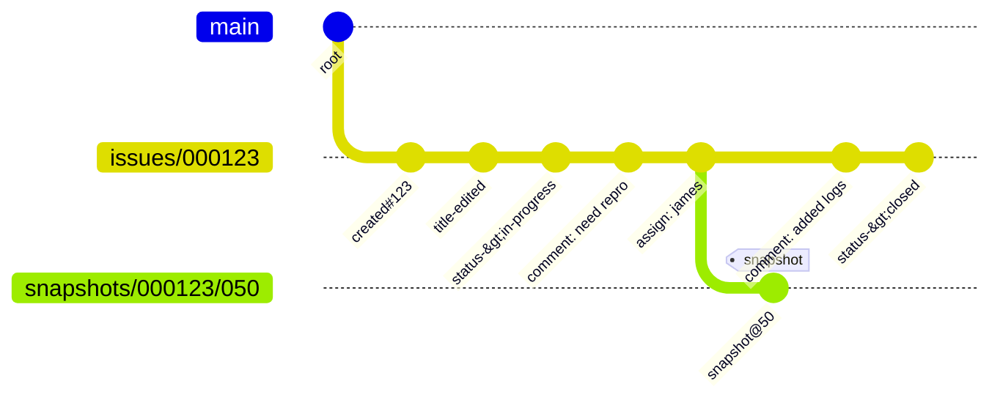
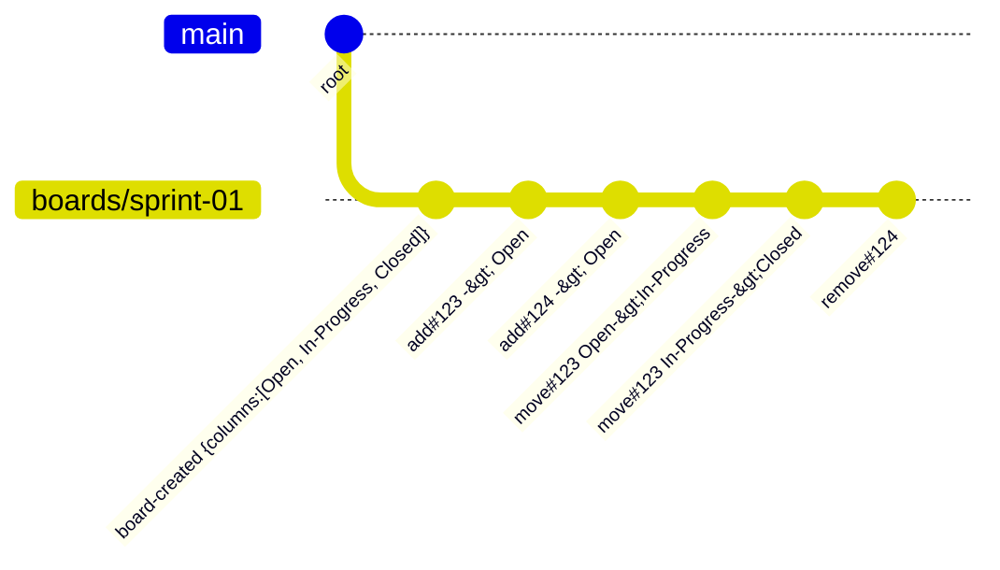
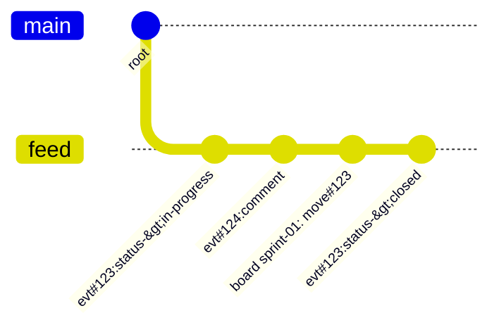

# Hubless Technical Specification

## Document Control
- Version: 0.1 (working draft)
- Last updated: 2025-09-18
- Owners: Architecture & Platform Engineering

## 1. Purpose
This document defines the architecture, data model, and integration contracts for Hubless. It complements the Product Requirements Document (`docs/PRD.md`) by detailing how the system delivers the promised capabilities. The specification focuses on the initial MVP and highlights extension points required for later phases.

## 2. System Overview
Hubless augments a Git repository with an event-sourced work-tracking subsystem and exposes the data through a Go-based CLI/TUI application.

### 2.1 High-Level Components
- **CLI/TUI Application**: Binary invoked as `hubless`. Provides commands for list/view/create/update/sync and a Bubbletea-based TUI (see `docs/design/tui.md`).
- **Event Store**: Git refs under `refs/hubless/**`. Issues, boards, feeds, and metadata are modeled as append-only commit chains.
- **Snapshot & Catalog Indexes**: Periodic commits that cache computed state to keep read operations under latency targets.
- **Sync Adapters**:
  - **Git Sync**: Bidirectional fetch/push of `refs/hubless/**` using Git’s eventual consistency model.
  - **GitHub Projection** (Phase 2+): Translates Hubless events into GitHub issues/PRs/comments and vice versa via the GitHub API.

### 2.2 Data Flow Summary
1. User triggers an action via CLI/TUI.
2. Command composes an event payload and writes a Git commit to the relevant ref.
3. Catalog and optional feed refs are updated as part of the same operation.
4. On `hubless sync`, remote refs are fetched and merged by set-union semantics (no merge commits).
5. GitHub projection (when enabled) processes new events and mirrors them to the GitHub API, recording a mapping in metadata refs.

## 3. Data Model
### 3.1 Namespace Layout
```
refs/
  hubless/
    issues/<issue-id>               # append-only event chain for one issue
    snapshots/<issue-id>/<ordinal>  # cached snapshots (every N events)
    boards/<board-name>             # board event chain (column changes, membership)
    catalog                         # tree of issue metadata for fast listing
    feed                            # optional activity feed aggregating recent event IDs
    meta/
      github-map                    # blob/tree mapping Hubless IDs to GitHub IDs
      version                       # schema version stamp
```

### 3.2 Event Vocabulary
| Event Type | Description | Typical Payload Keys |
|------------|-------------|----------------------|
| `issue:created` | Initial creation of an issue | `title`, `body`, `priority`, `labels` |
| `issue:edited` | Mutation of title/body metadata | `title?`, `body?`, `priority?`, `labels?` |
| `issue:status_changed` | Status transition | `from`, `to` |
| `issue:assigned` | Assignment changes | `assignee` |
| `issue:commented` | Comment added to timeline | `body` |
| `pr:opened` | Pull request created and linked | `branch`, `base` |
| `pr:merged` | Pull request merged | `merge_commit`, `closed_at` |
| `board:moved` | Issue moved between columns | `issue`, `from`, `to` |
| `board:configured` | Board column setup | `columns` |

Event types are extensible. Consumers must tolerate unknown payload fields.

### 3.3 Commit Message Schema
Each event commit uses a two-line format:
```
<subject>
<json_payload_on_single_line>
```
Example:
```
issue:status_changed
{"type":"issue:status_changed","issue":"000123","actor":"james","ts":"2025-09-18T23:15:47Z","payload":{"from":"open","to":"in-progress"},"lamport":2,"event_id":"1c0b8e6e3f3c6..."}
```
- `type`: canonical event type string.
- `issue` or resource identifier.
- `actor`: normalized username.
- `ts`: ISO-8601 timestamp (UTC).
- `payload`: event-specific data.
- `lamport`: monotonically increasing counter per issue for conflict-free ordering.
- `event_id`: optional stable hash (SHA1 of canonicalized payload) used for deduplication across projections.

### 3.4 Snapshot Commits
Snapshots capture materialized issue state. They live under `refs/hubless/snapshots/<issue-id>/<ordinal>` and store a tree containing serialized issue data (status, metadata, last event ID). The CLI reads the latest snapshot and replays subsequent events to rebuild current state within the desired latency budget.

### 3.5 Catalog Commit Layout
The catalog ref points to a commit whose tree summarizes all issues:
```
/issues/
  000123  # blob contains tip OID, last update timestamp, priority tag, status
/meta/
  version
  updated_at
```
The list command and TUI list view read this tree to avoid enumerating every issue ref.

### 3.6 Activity Feed (Optional)
`refs/hubless/feed` aggregates event IDs since the previous feed head. Each commit lists event OIDs in chronological order. The TUI can tail this ref to render a “what changed recently” panel without scanning every issue.

## 4. Command and API Surface
### 4.1 CLI Commands (MVP)
| Command | Description | Event(s) Produced |
|---------|-------------|-------------------|
| `hubless list` | Print issue summaries from catalog | none |
| `hubless view <id>` | Show timeline with comments and metadata | none |
| `hubless create` | Launch editor, create new issue | `issue:created` (and optional `issue:commented` for body) |
| `hubless status <id> --to <state>` | Transition status | `issue:status_changed` |
| `hubless assign <id> --to <user>` | Update assignee | `issue:assigned` |
| `hubless comment <id>` | Append comment | `issue:commented` |
| `hubless kanban` | Launch TUI kanban board | `board:moved` as user rearranges |
| `hubless sync` | Synchronize refs with remotes and optional GitHub | none (but triggers projection writes) |

Future commands include `hubless pr <branch>` (creates `pr:opened`), `hubless export`, and `hubless lsp`.

### 4.2 TUI Interaction Model
See `docs/design/tui.md` for detailed view flows, key bindings, and Bubbletea composition. The TUI invokes the same application services described in Section 6.

## 5. Application Architecture
Hubless follows a hexagonal architecture with the following layers:
- **Domain**: Event definitions, issue aggregates, replay logic.
- **Application Services**: Orchestrate commands, perform validation, compute derived data.
- **Adapters**: Implement persistence via Git, optionally GitHub. TUI and CLI commands act as inbound adapters.

```
hubless/
├─ cmd/hubless/main.go
├─ internal/domain/
├─ internal/application/
├─ internal/ports/
├─ internal/adapters/
│   └─ gitstore/
└─ internal/ui/tui/
```

## 6. Git Adapter Specification
### 6.1 Responsibilities
- Write event commits using `git mktree` + `git commit-tree` with empty or minimal trees.
- Atomically advance refs with `git update-ref` to avoid race conditions.
- Maintain catalog and optional feed refs in the same transaction window.
- Expose a `ListIssues`, `LoadEvents`, and `AppendEvent` API to the application layer.

### 6.2 Plumbing Sequence (Append Event)
```
1. tree=$(printf "" | git mktree)
2. msg=$'issue:status_changed\n{"type":"issue:status_changed",...}'
3. new_oid=$(printf "%s" "$msg" | git commit-tree "$tree" -p "$current_ref_head" --author "$AUTHOR" --date "$DATE")
4. git update-ref refs/hubless/issues/<id> "$new_oid" "$current_ref_head"
5. Update catalog and feed refs via additional commit-tree + update-ref operations
```
All plumbing commands run within the repository root passed to the adapter. Failures must roll back to the previous ref head.

### 6.3 Stable Event IDs
Stable IDs prevent duplicate publications during sync. The recommended algorithm:
```
event_id = sha1(type + "\0" + issue + "\0" + ts + "\0" + actor + "\0" + canonical_json(payload))
```
The adapter stores `event_id` in the commit payload and uses it to match remote commits and GitHub artifacts.

## 7. Synchronization Model
### 7.1 Git Remotes
Configure remotes to fetch/push Hubless refs:
```
[remote "origin"]
    fetch = +refs/heads/*:refs/remotes/origin/*
    fetch = +refs/hubless/**:refs/hubless/**
    push  = +refs/hubless/**:refs/hubless/**
```
`hubless sync` executes `git fetch --prune` followed by `git push` with failure handling that retries idempotently.

### 7.2 GitHub Projection (Phase 2)
- **Outbound mapping**: Translate new Hubless events into GitHub API calls (create issue, add comment, update labels/state). Record GitHub issue IDs in `refs/hubless/meta/github-map`.
- **Inbound mapping**: Periodically poll GitHub for changes. Convert remote updates into Hubless events, using `event_id` deduplication.
- **Authentication**: Reuse `gh` CLI credentials or PAT tokens. Store no secrets in the repository.

## 8. Performance and Scaling
- Catalog reads avoid scanning every ref; list view target <200 ms for 10k issues.
- Snapshot frequency tuned to replay at most 100 events per issue in the hot path.
- Use compression-friendly payloads; event commits are small (<2 KB typical).
- `hubless sync` should short-circuit if no refs changed since last fetch.

## 9. Security and Compliance
- Respect Git repository ACLs; Hubless never bypasses Git permissions.
- GitHub integration uses least-privilege tokens (issues + pull_request scopes).
- Event payloads should exclude secrets; clients must redact or encrypt sensitive data before commit.
- Provide audit logs by virtue of Git history; document procedures for deletion (force-push not recommended).

## 10. Observability and Operations
- CLI emits structured logs (JSON) when `HUBLESS_LOG=json` is set.
- Provide `hubless doctor` to verify ref health, snapshot freshness, and remote configuration.
- Document backup strategy: repository cloning suffices; snapshots ensure quick restore.

## 11. Risks and Mitigations
| Risk | Mitigation |
|------|------------|
| Large repositories hitting ref limits | Namespaces keep refs organized; monitor ref counts; allow pruning of archived issues |
| GitHub API rate limits | Batch operations, respect conditional requests, exponential backoff |
| Divergent schemas between clients | Encode schema version in `refs/hubless/meta/version`; clients refuse incompatible versions |

## 12. Appendices
### Appendix A: Mermaid Diagrams
#### Per-Issue Chain with Snapshots


#### Board Event Chain


#### Activity Feed


### Appendix B: Reference Commands
See Section 6.2 for the commit sequence. Additional helper scripts can live under `scripts/` in the repository.
