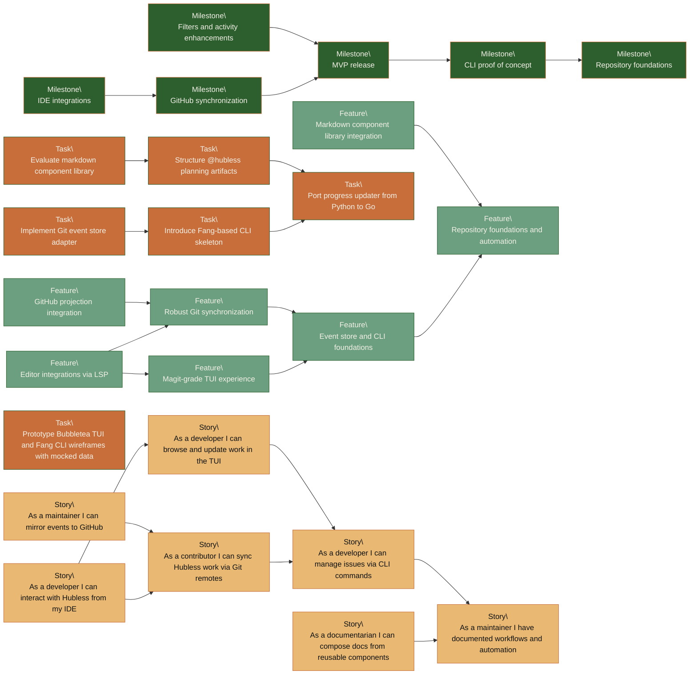

<!-- Generated by docs-components; do not edit manually. -->

```mermaid
graph LR
    n0["Milestone\\nCLI proof of concept"]
    n1["Milestone\\nRepository foundations"]
    n10["Feature\\nEditor integrations via LSP"]
    n11["Feature\\nRepository foundations and automation"]
    n12["Feature\\nMagit-grade TUI experience"]
    n13["Story\\nAs a maintainer I have documented workflows and automation"]
    n14["Story\\nAs a developer I can manage issues via CLI commands"]
    n15["Story\\nAs a developer I can browse and update work in the TUI"]
    n16["Story\\nAs a contributor I can sync Hubless work via Git remotes"]
    n17["Story\\nAs a maintainer I can mirror events to GitHub"]
    n18["Story\\nAs a developer I can interact with Hubless from my IDE"]
    n19["Story\\nAs a documentarian I can compose docs from reusable components"]
    n2["Milestone\\nFilters and activity enhancements"]
    n20["Task\\nPort progress updater from Python to Go"]
    n21["Task\\nStructure @hubless planning artifacts"]
    n22["Task\\nEvaluate markdown component library"]
    n23["Task\\nIntroduce Fang-based CLI skeleton"]
    n24["Task\\nImplement Git event store adapter"]
    n25["Task\\nPrototype Bubbletea TUI and Fang CLI wireframes with mocked data"]
    n3["Milestone\\nMVP release"]
    n4["Milestone\\nGitHub synchronization"]
    n5["Milestone\\nIDE integrations"]
    n6["Feature\\nMarkdown component library integration"]
    n7["Feature\\nEvent store and CLI foundations"]
    n8["Feature\\nRobust Git synchronization"]
    n9["Feature\\nGitHub projection integration"]
    classDef task fill:#C86E3B,stroke:#2C5F2D,color:#F4F1E8,stroke-width:1px;
    classDef milestone fill:#2C5F2D,stroke:#C86E3B,color:#F4F1E8,stroke-width:1px;
    classDef feature fill:#6B9F7F,stroke:#2C5F2D,color:#F4F1E8,stroke-width:1px;
    classDef story fill:#E9B872,stroke:#C86E3B,color:#0E1111,stroke-width:1px;
    class n0 milestone;
    class n1 milestone;
    class n10 feature;
    class n11 feature;
    class n12 feature;
    class n13 story;
    class n14 story;
    class n15 story;
    class n16 story;
    class n17 story;
    class n18 story;
    class n19 story;
    class n2 milestone;
    class n20 task;
    class n21 task;
    class n22 task;
    class n23 task;
    class n24 task;
    class n25 task;
    class n3 milestone;
    class n4 milestone;
    class n5 milestone;
    class n6 feature;
    class n7 feature;
    class n8 feature;
    class n9 feature;
    n0 --> n1
    n2 --> n3
    n3 --> n0
    n4 --> n3
    n5 --> n4
    n6 --> n11
    n7 --> n11
    n8 --> n7
    n9 --> n8
    n10 --> n12
    n10 --> n8
    n12 --> n7
    n14 --> n13
    n15 --> n14
    n16 --> n14
    n17 --> n16
    n18 --> n16
    n18 --> n15
    n19 --> n13
    n21 --> n20
    n22 --> n21
    n23 --> n20
    n24 --> n23
```
